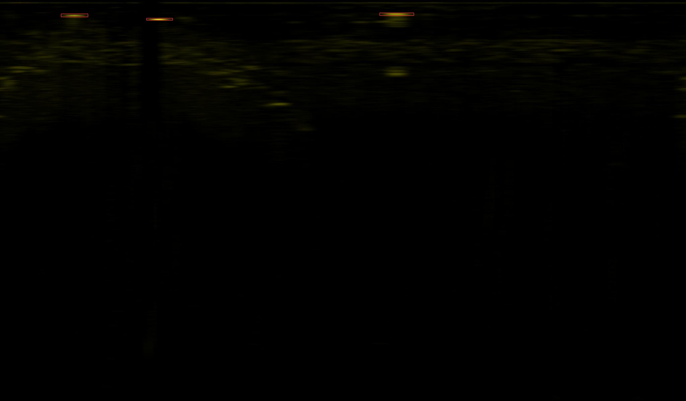
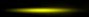
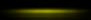

# TargetDetection

---

### Build

```shell
git clone https://github.com/dddyom/TargetDetection && cd TargetDetection
```

**Creating a virtual environment**

```shell
python -m venv env
source env/bin/activate
pip install -r requirements.txt
python -m pip install --upgrade pip
git clone https://github.com/ultralytics/yolov5.git
```

**Replacing the original detect in yolov5 with our own, modified**

```shell
rm yolov5/detect.py && mv custom_detect.py yolov5/detect.py
```

**Entering launch options**

```shell
nano config.ini
```

### Run

```shell
(source env/bin/activate)
time python main.py
```

---

### Result example

**jpg**



**Cropped**






**txt**

```json
{"x": 476.0, "y": 57.0, "a": 83.672, "d": 17.1, "conf": 0.8}
{"x": 1184.0, "y": 42.0, "a": 208.125, "d": 12.6, "conf": 0.802}
{"x": 222.0, "y": 45.5, "a": 39.023, "d": 13.65, "conf": 0.85}
```

- x, y - source coordinates

- a, d - azimuth, distance

- conf - confidence


